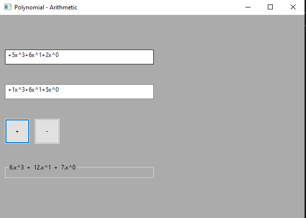

# Polynomial-Arithmetic
Coded in cpp using wxWidget for UI, addition and subtraction of two single variable(x) polynomials. Implementation done using Linked List data structure. Aim is tho create a complete system for arithmetis on polynomials with more then one variable and with no syntax limit.

## Syntax used for polynomial inputs:
* using only one variable x (small)
* currently work on only [0-9] integer values range for coff and powers
* no space should been used in between polynomials 
* simplified form of poylnomial should be used 

## Some known errors:
* copy pasting polynomials may give error
* -ve values may face some errors 

